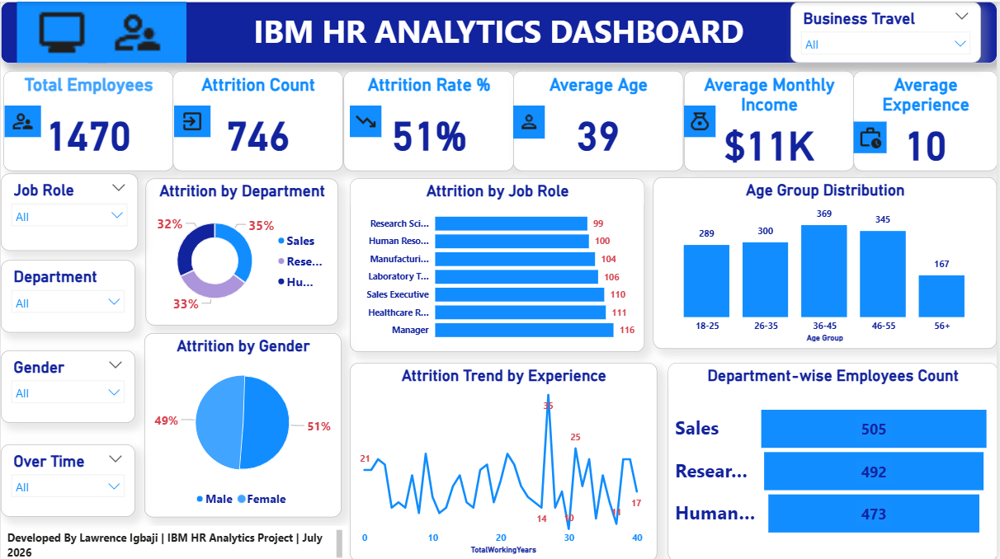

# IBM HR Analytics Dashboard

## Overview

This project is an interactive HR Analytics Dashboard built in Power BI. The goal was to analyze employee data and uncover insights into attrition, workforce demographics, departmental distribution, and other key HR metrics. The dashboard is designed to help HR professionals make informed, data-driven decisions.

---

## Dashboard Preview

---

## Key Features

- Interactive dashboard with slicers
- Employee attrition analysis
- Department-wise employee distribution
- Age group analysis
- Gender distribution
- Employee performance overview
- KPI cards for quick business insights

---

## KPIs

- Total Employees
- Attrition Count
- Attrition Rate
- Average Age
- Average Monthly Income
- Average Years at Company

---

## Tools Used

- Power BI
- Power Query
- DAX (Data Analysis Expressions)

---

## Dataset

The project uses the IBM HR Analytics Employee Attrition dataset, which contains employee demographic and workplace information for HR analysis.

---

## What I Learned

Working on this project helped me strengthen my skills in:
- Data cleaning with Power Query
- Creating DAX measures
- Designing interactive dashboards
- Building KPI cards
- Data visualization and storytelling

---

## Repository Contents

- IBM_HR_Analytics.pbix – Power BI project file
- HR_Analytics.csv – Dataset
- dashboard.png – Dashboard screenshot
- README.md – Project documentation

---

## About Me

I'm Lawrence Igbaji, an aspiring Data Analyst passionate about transforming data into meaningful insights through Power BI, Excel, SQL, and Python.

Feel free to connect with me and check out my other projects.

⭐ If you found this project helpful, consider giving it a star!

